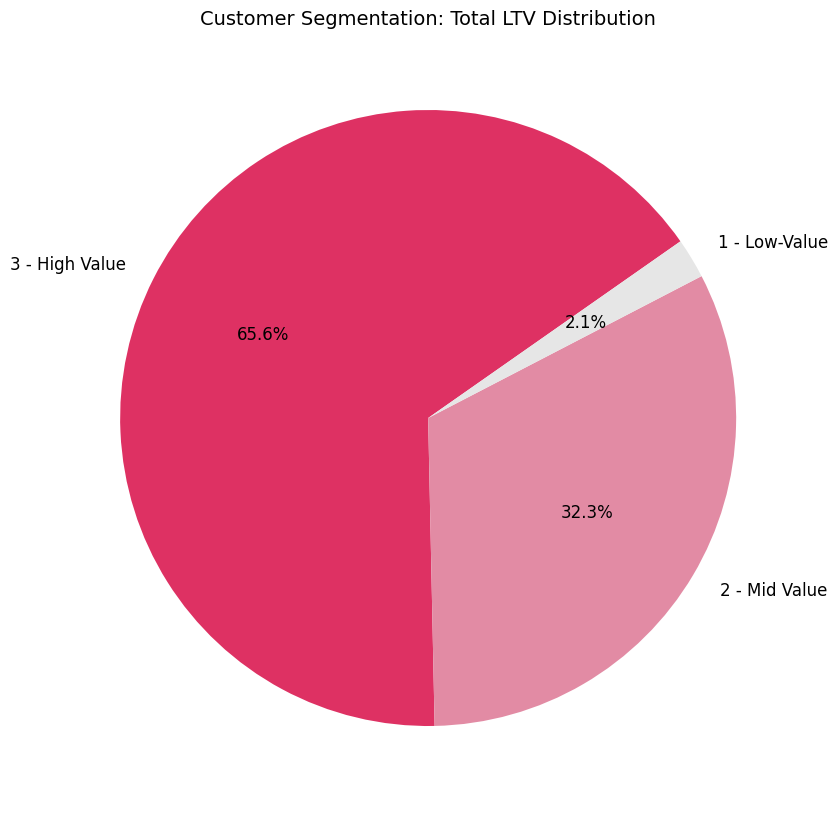
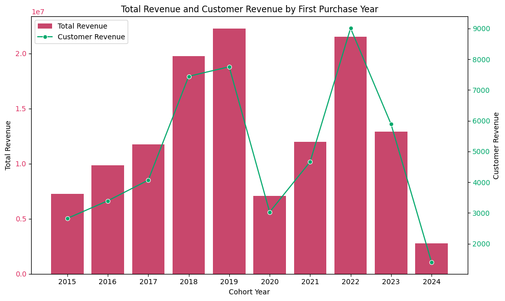
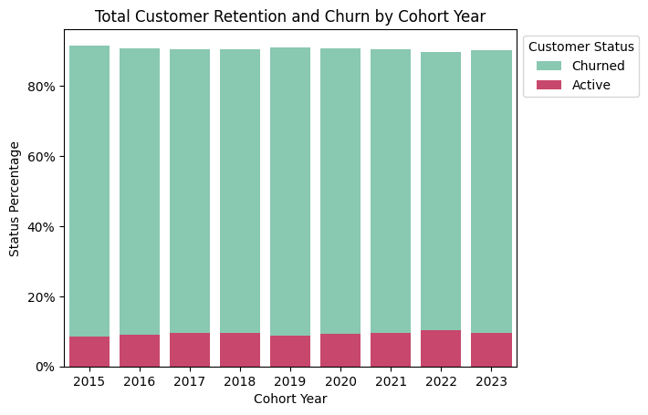

# Intermediate SQL Job Posting Analysis

# Introduction
Analyze e-commerce datasets with SQL queries and visualize the results with Python. This project heavily inspired by Luke Barousse YouTube course [SQL Course - Intermediate Course + Project](https://www.youtube.com/watch?v=QKIGsShyEsQ) for learning purpose. To search the dataset source, watch that YouTube.

## Overview
Analysis of customer behavior, retention, and lifetime value for an e-commerce company to improve customer retention and maximize revenue.

## Tools
Database: PostgreSQL
Analysis Tools: PostgreSQL
Visualization: Python, Google Colab

## Business Questions
1. Customer Segmentation: Who are our most valuable customers?
2. Cohort Analysis: How do different customer groups generate revenue?
3. Retention Analysis: Which customers haven't purchased recently?

# Clean Up Data
Query: [0_View_intro.sql](0_View_Intro.sql)
Content of that query:
- Aggregated sales and customer data to derive key revenue metrics
- Identified customers’ first purchase dates to support cohort analysis
- Built a unified view integrating transaction records and customer profiles

# Analysis
## 1. Customer Segmentation
Query: [1_customer_segmentation.sql](1_customer_segmentation.sql)
Content of the query:
- Categorized customers based on total lifetime value (LTV)
- Assigned customers to High, Mid, and Low-value segments
- Calculated key metrics like total revenue

Visualization:

Key Findings:
- High-value segment (25% of customers) drives 66% of revenue ($135.4M)
- Mid-value segment (50% of customers) generates 32% of revenue ($66.6M)
- Low-value segment (25% of customers) accounts for 2% of revenue ($4.3M)

Insight:
- High-Value (66% revenue): Offer premium membership program to 12,372 VIP customers, as losing one customer significantly impacts revenue
- Mid-Value (32% revenue): Create upgrade paths through personalized promotions, with potential $66.6M → $135.4M revenue opportunity
- Low-Value (2% revenue): Design re-engagement campaigns and price-sensitive promotions to increase purchase frequency

## 2. Cohort Analysis
Query: [2_cohort_analysis.sql](2_cohort_analysis.sql)
Content of the query:
- Tracked revenue and customer count per cohorts
- Cohorts were grouped by year of first purchase
- Analyzed customer revenue at a cohort level

Visualization:

Key Findings:
- Customer revenue is declining, older cohorts (2016-2018) spent ~$2,800+, while 2024 cohort spending dropped to ~$1,970.
- Revenue and customers peaked in 2022-2023, but both are now trending downward in 2024.
- High volatility in revenue and customer count, with sharp drops in 2020 and 2024, signaling retention challenges.

Insights:
- Boost retention & re-engagement by targeting recent cohorts (2022-2024) with personalized offers to prevent churn.
- Stabilize revenue fluctuations and introduce loyalty programs or subscriptions to ensure consistent spending.
- Investigate cohort differences by applying successful strategies from high-spending cohorts (2016-2018) to newer ones.

## 3. Retention Analysis
Query: [3_retention_analysis.sql](3_retention_analysis.sql)
Content of the query:
- Identified customers at risk of churning
- Analyzed last purchase patterns
- Calculated customer-specific metrics

Visualization:

Key Findings:
- Cohort churn stabilizes at ~90% after 2-3 years, indicating a predictable long-term retention pattern.
- Retention rates are consistently low (8-10%) across all cohorts, suggesting retention issues are systemic rather than specific to certain years.
- Newer cohorts (2022-2023) show similar churn trajectories, signaling that without intervention, future cohorts will follow the same pattern.

Insights:
- Strengthen early engagement strategies to target the first 1-2 years with onboarding incentives, loyalty rewards, and personalized offers to improve long-term retention.
- Re-engage high-value churned customers by focusing on targeted win-back campaigns rather than broad retention efforts, as reactivating valuable users may yield higher ROI.
- Predict & preempt churn risk and use customer-specific warning indicators to proactively intervene with at-risk users before they lapse.